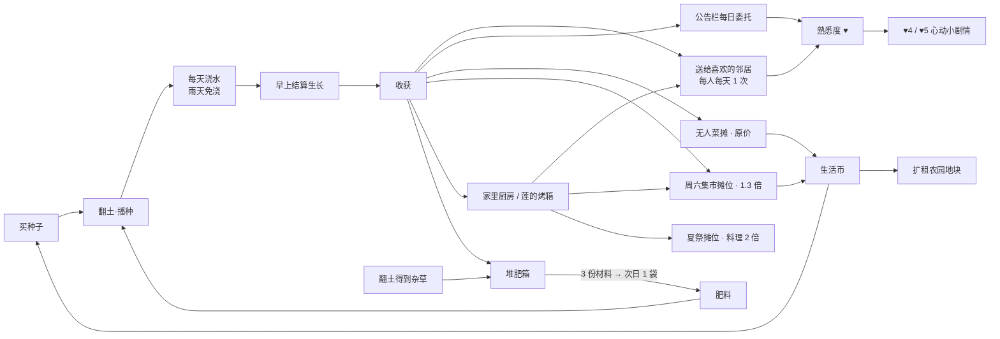

# 时间 · 天气 · 种植 · 料理 · 节日 v0.5

v0.3 的晴町是一个“一口气玩完”的切片：没有日夜，集市由玩家随时开启。v0.4 让晴町变成可以一直住下去的地方。时间会流动，天会下雨，菜会一天天长大，邻居们按作息在街上走动。所有新系统都围绕同一个目标：让玩家每天醒来都有一件想做的小事，并且这件小事和邻居有关。

## 1. 设计原则

- **不惩罚。** 没有体力值，作物不会枯死，过了深夜也不会掉东西。忘了浇水只是那天不长。
- **每天都有回报。** 生长天数很短（2–5 天）。一局 12 分钟左右的现实时间就是一天，玩一晚上能看到好几次收获。
- **种植服务于人际关系。** 收获物的主要去向是送礼、完成邻居的委托和在集市上摆摊，而不是刷钱。
- **沿用 v0.3 的规则风格。** 所有规则写在 `GameState`，由测试覆盖。交付是原子操作，重要物品不能卖。

## 2. 时间

| 项目 | 规则 |
| --- | --- |
| 一天 | 06:00 起床 → 24:00 必须睡觉。游戏内 1 分钟 = 现实 0.67 秒，完整一天约 12 分钟 |
| 暂停 | 暂停菜单、对话、商店、布置模式、小游戏和转场期间时间停止 |
| 星期 | 第 1 天是周四（搬家日）。周六傍晚办集市，所以第 3 天就能赶上第一场 |
| 睡觉 | 家里的床：18:00 前可以“午睡到傍晚”（跳到 16:30）；18:00 后可以“睡到明天”。睡觉会自动存档 |
| 熬夜 | 到 24:00 会迷迷糊糊地回家睡着，第二天 07:00 醒来。没有其他惩罚 |
| 光影 | 按分钟连续插值：清晨（冷蓝雾 + 暖阳）→ 白天 → 傍晚金色 → 黄昏紫粉（18:30 路灯亮）→ 夜晚深蓝（星空天球） |

天空由白天、黄昏、夜晚三张全景图在 shader 里混合。天空缓慢旋转，看起来像云在飘。远景卡片和雾的颜色一起变化，避免夜里远山还亮着。

## 3. 天气

- 每天早上按天数作种子掷骰：晴 60%，多云 25%，雨 15%。
- **周六总是晴天**（这也是“晴町”名字的由来，邻居对话里会提到）。第 1–3 天也固定为晴天，保证第一个周末顺利。
- 雨天会自动浇透所有露天地块，温室除外。雨天有雨滴粒子、雨声、更低的饱和度和更浓的雾。邻居站到屋檐下，说的话也不一样。

## 4. 地块

| 地点 | 数量 | 开放条件 | 特点 |
| --- | --- | --- | --- |
| 庭院种植箱 | 1 | Q03 完成后，收下春的番茄 | 靠近饮水台；春每天路过会夸一句 |
| 自家小院 | 4 | Q06 拿到锄头后 | 在家里缘侧外，出门就能浇 |
| 河边市民农园 | 12 | Q06 租到 4 块；种植等级 2 / 4 时再花 200 / 600 生活币向田中爷爷扩租 4 + 4 块 | 旁边有手压泵、堆肥箱、无人菜摊 |
| 农园温室 | 2 + 2 | Q07 完成后 2 块；等级 6 花 900 在后面再盖一间 | 只能种草莓；不受天气影响，雨天也要自己浇 |
| 小院扩建 | +2 | 等级 3，600 生活币（田中的种子铺） | 小院西侧两块 |

地块状态：`荒地 → 已翻土 → 已播种 → 幼苗 → 成长中 → 可收获`。

- **翻土**需要锄头，每块地只需一次，会得到 2 份杂草（堆肥材料）。
- **播种**：选背包里的种子，每次 1 袋。
- **浇水**：洒水壶容量 5 次，在手压泵、饮水台或家里水龙头装满。当天浇过的土颜色变深。
- **生长**：每天早上结算。昨天浇过水（或下过雨）的作物 +1 天，施过肥的作物第一晚额外 +1 天。
- **收获**：一次性作物收完变回“已翻土”，可多次收获的作物回到“成长中”。

## 5. 作物（v0.5：15 种，按种植等级解锁）

| 等级 | 作物 | 天数 | 再收获 | 产量 | 卖价 | 种子 | 最喜欢的人 |
| --- | --- | --- | --- | --- | --- | --- | --- |
| 1 | 小松菜 | 2 | — | 2 | 16 | 15 | 澪 |
| 1 | 萝卜 | 3 | — | 1 | 50 | 20 | 田中爷爷 |
| 1 | 胡萝卜 | 3 | — | 2 | 22 | 18 | 小葵 |
| 1 | 向日葵 | 5 | — | 1 | 80 | 25 | 春、小葵 |
| 2 | 迷你番茄 | 4 | 每 2 天 | 3 | 14 | 35 | 澪 |
| 2 | 黄瓜 | 3 | 每 2 天 | 2 | 19 | 35 | 莲 |
| 2 | 土豆 | 4 | — | 3 | 24 | 30 | 莲 |
| 3 | 毛豆 | 3 | — | 3 | 22 | 30 | 田中爷爷 |
| 3 | 洋葱 | 4 | — | 3 | 22 | 25 | — |
| 3 | 小麦 | 4 | — | 4 | 10 | 20 | —（在面包店磨成面粉） |
| 4 | 茄子 | 5 | 每 3 天 | 2 | 30 | 40 | 春 |
| 4 | 玉米 | 5 | — | 3 | 36 | 35 | 小葵 |
| 5 | 草莓（温室） | 5 | 每 3 天 | 3 | 28 | 60 | 小葵、澪 |
| 6 | 南瓜 | 7 | — | 1 | 170 | 70 | 春 |
| 7 | 西瓜 | 8 | — | 1 | 240 | 90 | 小葵、莲 |

- 种子在晴町商店（全部）、田中的种子铺（常用的几种和草莓苗）、花店（向日葵、小松菜）买，等级不够的会显示锁。
- 施肥：产量 +1，当晚多长 1 天（9 级起 2 天）。
- 收益的比较和理由见 [BALANCE.md](BALANCE.md)。

## 6. 循环与资源去向

## 7. 熟悉度（♥ 0–5）

- 主线仍给 ♥1–3，上限从 3 提高到 5。
- 每位邻居每天：第一次聊天 +1 温度。送普通作物 +1，送最喜欢的作物 +2，完成他的每日委托 +2。每攒满 4 点温度得 ♥1。
- ♥4 和 ♥5 各有一段小剧情，要在特定时间和地点触发，例如澪在黄昏的河边木桥上。

## 8. 新地点：河边市民农园

主街东端原本写着“主街从这里拐下坡去”，现在可以下坡去河边。农园是一个独立区域（`FarmBuilder`，世界坐标 x = 400），玩法上与小镇一样可以自由走动，通过淡出转场进出。

- 南侧是一条缓缓流动的小河（流动水面 shader），上面有拱形木桥，桥对岸有一张看夕阳的长椅。
- 3 × 4 的地块，中间立着稻草人。工具棚是田中爷爷的“种子铺”，旁边是手压泵和堆肥箱。东边是温室，路边是无人菜摊。
- 远景是河对岸的堤坝、电线杆和山丘的手绘卡片。有蜻蜓、麻雀、河水声和蝉鸣。

## 9. 新邻居

| 角色 | 设定 | 作息 |
| --- | --- | --- |
| 田中爷爷（74） | 农园管理员，春的老朋友。话不多但很会教人，年轻时给春写过一封没寄出的信 | 06–17 在工具棚前，17–19 在河边长椅，之后回家 |
| 小葵（10） | 春的孙女，暑假来晴町住。第 2 天出现，想种一株和奶奶一样高的向日葵，作为奶奶的生日礼物 | 上午在庭院陪春，下午在农园抓蜻蜓，傍晚回庭院 |

原有邻居也有作息：莲 18 点关店后到庭院长椅，春傍晚在种植箱旁，澪中午去花店。21 点后大家都回家了，街上只剩路灯、猫和风声。

## 10. 新委托

| 委托 | 委托人 | 内容 | 奖励 |
| --- | --- | --- | --- |
| Q06 河边的菜园 | 春（Q03 后） | 带着春的信下坡去农园 → 见田中爷爷 → 翻土 → 播种 → 浇水 → 回报 | 锄头、洒水壶、2 袋种子、4 块地，+30 生活币，♥田中 |
| Q07 第一次收获 | 田中爷爷（Q06 后） | 等作物成熟 → 收获 → 在无人菜摊卖出 1 份 | 温室 2 块地 + 1 袋草莓种子 + 2 袋肥料 |
| Q08 小葵的向日葵 | 小葵（第 2 天起，Q06 后） | 种下小葵给的向日葵种子 → 养到开花 → 收获 → 送给小葵 | 生日小剧情，向日葵发夹，♥小葵 ♥春 |
| Q09 周六的菜摊 | 澪（第一次集市后） | 在周六集市摊位卖出 5 份作物 | 集市改为每周举办，+50 生活币 |
| 每日委托 | 公告栏 | 每天随机一位邻居想要 1–3 份某种作物 | 生活币 + 2 温度 |

Q05 的变化：“开始集市”只能在周六 16:30 之后。周六白天找澪，可以选“在长椅上等到傍晚”；其他日子澪会约在周六傍晚。第一次集市仍然是 v0.3 的结尾演出，结束后游戏继续：第二天早上庭院恢复日常，之后每个周六傍晚自动开集市。

## 11. 对话

对话放在 `data/dialogue.json`，每条带条件：时段、天气、星期、熟悉度区间、需要或排除的 flag、委托状态、最早天数。选择规则：筛出所有满足条件的条目，优先选条件最具体、今天还没说过的一条。每位邻居至少 15 条日常对话，外加雨天、夜晚、周末、集市、心动剧情专属的台词。地点的旁白（信箱、电视、院子等）也按时间和天气变化。

## 12. 生动感

- **风**：树、灌木、花和作物的顶点按高度摆动（`foliage_sway` shader），风速随天气变化，雨天更大。
- **人物动画**：新增 wave（挥手）、look（张望）、stretch（伸懒腰）、crouch（蹲下照料）、talk（说话手势）片段。NPC 站着时每 6–15 秒随机做一个动作；玩家当天第一次走近时会挥手；对话时播放 talk；春和田中爷爷会蹲下照料作物。
- **环境生物**：会跳着啄食、人走近就飞走的麻雀群；在长椅上打呼噜的三花猫、蹲在墙头会转头看玩家的橘猫；绕着花飞的蝴蝶；河上的蜻蜓。

## 13. 存档

`SAVE_VERSION` 升到 2，新增 day、minute、weather、plots、compost、water、warmth、daily 等字段。v1 存档读入时补默认值（第 1 天 09:00，地块全部未开放），旧进度不丢失。

## 14. v0.5 新增

### 种植经验

翻土、播种、浇水、收获都给经验（数值见 [BALANCE.md](BALANCE.md)），升级时屏幕上方弹出卡片，写明解锁了什么。HUD 左上角金币后面是等级和经验条，背包界面也显示经验。

### 商店和面包店

- **晴町商店**（主街西头 S01，门口有货架和菜箱）：卖全部种子、10 种调料（面粉、砂糖、盐、酱油、味噌、米、牛奶、黄油、鸡蛋、咖喱块）、背包和洒水壶升级，盂兰盆前后卖纸灯笼，夏天卖仙女棒；收作物、料理，半价收调料和种子。周三休息。
- **莲的面包店**：卖菠萝包和几种调料；8 张配方卡；“借用烤箱”打开烘焙界面，也能用石磨把小麦磨成面粉；1.2 倍收面包和蛋糕。
- 所有商店都是同一个界面：顶部是 codex 画的店面横幅，“买东西 / 卖东西”两个标签，每行写价格、库存、等级锁；卖的一栏显示当天是否已经打折。

### 配方（24 个）

| 地方 | 配方 | 解锁 |
| --- | --- | --- |
| 家里厨房 | 番茄沙拉、小松菜味噌汤、毛豆饭团、浅渍黄瓜、月见团子 | 一开始就会 |
| 家里厨房 | 金平胡萝卜、萝卜炖菜（2 级）；土豆可乐饼（3 级）；味噌烤茄子、玉米浓汤（4 级）；蔬菜天妇罗（5 级）；南瓜煮物（6 级）；西瓜切块（7 级） | 种植等级 |
| 家里厨房 | 夏日蔬菜咖喱（澪 ♥3 或 5 级）、草莓果酱（小葵 ♥2） | 邻居教 |
| 莲的烤箱 | 番茄佛卡夏、葵花籽面包、街坊三明治、胡萝卜蛋糕、咖喱面包、玉米面包、草莓奶油蛋糕（也可以莲 ♥3）、南瓜面包 | 配方卡 120–350 |
| 石磨 | 3 份小麦 → 2 袋面粉 | 一开始就会 |

每个料理都有“最喜欢的人”：送料理给邻居 +2 温度，送他最喜欢的 +3（作物是 1 / 2）。

### 背包和收纳箱

- 背包按“格”算：每格一种东西，最多叠 99 个；20 格起步，可以买到 30 / 40 格。
- 背包界面分全部、种子、作物、料理、材料、重要六个标签（图标是 codex 画的）。
- 家里走廊的木箱是收纳箱，60 格。左键整组放进 / 取出，右键一次一个。重要物品不能放。
- 每天晚上睡觉后，早上的卡片会写昨天的收入、支出和经验。

### 节日

| 日期 | 节日 | 地点和时间 | 可以做什么 | 奖励 |
| --- | --- | --- | --- | --- |
| 7月7日（周日，第 4 天） | 七夕 | 庭院门口，17:00–22:30 | 在竹子上挂短册，四个愿望各对应一位邻居 | 那位邻居 +2 温度，短册一直挂着 |
| 7月14日（周日，第 11 天） | 晴町蔬菜品评会 | 庭院长桌，10:00–15:00 | 交一份作物，评分 = 卖价 ×（1 + 0.08 × 种植等级）；对手是田中的特大萝卜 88、春的向日葵 96、小葵的草莓 42 | 金 / 银 / 铜 / 入选：300 / 150 / 60 / 20，金奖还有绶带 |
| 7月20日（周六，第 17 天） | 晴町夏祭 | 庭院，17:00–22:00，代替当天的集市 | 盆舞台、两个屋台（苹果糖、仙女棒）、灯笼串；自己的摊位料理 2 倍价；20 点起加入盆舞 | 盆舞：五位邻居各 +1 温度 |
| 7月27日（周六，第 24 天） | 晴川花火大会 | 农园河边，19:30–21:00（集市照常） | 在河边长椅选一个人一起看烟花 | 那个人 +3 温度 |
| 8月15日（周四，第 43 天） | 盂兰盆 · 灯笼流 | 农园木桥，18:30–21:30 | 从桥上放一盏纸灯笼（没有的话春会给一盏） | 春、田中 +2 温度 |
| 9月17日（第 76 天） | 月见 | 庭院供台，19:00–23:00 | 供一份月见团子 | 澪、春、莲 +1 温度 |

- 节日当天一定晴天；前一天就开始布置（竹子、长桌、盆舞台会提前出现，布置在的时候才有碰撞）。
- 节日开始时弹出卡片（codex 画的节日横幅 + 说明），HUD 右上角显示“今天：七夕 17:00–22:30”，天气图标换成灯笼。按 C 或在暂停菜单打开日历：本月格子里标出节日、周六集市和商店休息日，下面是下一个节日的横幅和说明。
- 节日期间邻居站到节日的位置，说节日专属的台词（每人每个节日 1 条）。
