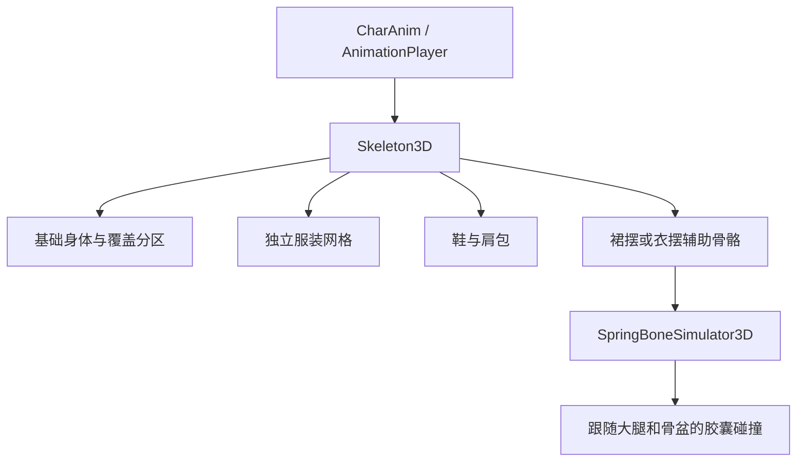

# Godot 人物服装：T pose、绑定、换装和动作

本轮以原人物外观为准，重新生成空与澪的 T pose。保留薄荷色衬衫、白色内搭、宽腿短裤和橙色鞋，以及澪的奶油色开衫、蓝色衬衫、深蓝百褶裙、白鞋、黄色发夹和肩包。之前把通用人体和服装直接拼接到角色头部的候选全部淘汰。

## 为什么只调整动作不够

旧模型的手臂在 A pose 中贴着衣服，腋下存在粘连、破损和错误权重。改变手臂动作会拉出一片衣服；把接缝剪开又会暴露不完整的袖子。T pose 参考图明确展示袖管与身体之间的空隙，能减少生成阶段的粘连，但仍需检查真实网格。

本次 Hyper3D 使用正面、背面两张同角色参考，Gen-2.5 High、Quad 50,000。GLB 实际是三角形：空 96,169 三角形、澪 94,355 三角形，不把请求中的 Quad 数量当作最终三角形预算。源文件在 `art/models/raw/character_pipeline_tpose_20261004/`。两个已完成任务按官方基础价格估算共 1 积分，MCP 没有提供实际扣费或余额查询结果。[Hyper3D 价格与生命周期](https://docs.hyper3d.ai/en/api-specification/rodin-gen2-5)

## 本项目适合的服装结构

推荐先使用骨骼蒙皮作为主体，再对需要的部位加局部修形和次级运动。贴身部分和自由摆动部分需要不同处理。

| 部位 | 处理方式 | 验收重点 |
| --- | --- | --- |
| 衬衫、开衫主体和袖子 | 与身体共用骨架；权重转移后修正肩、肘、腕；袖管保持完整 | 抬手时腋下没有粘连、缺口和长三角；袖口不被手腕拖走 |
| 肘部、手腕 | 前臂扭转辅助骨骼；必要时添加姿态修形 | 掌心朝向自然；弯肘和转腕时保持体积 |
| 裙摆、松散衣摆 | 独立辅助骨骼链；少量弹簧运动；大腿和骨盆的简化碰撞 | 走路、蹲伏和舞蹈完整周期中没有膝盖穿出；摆幅符合衣服款式 |
| 肩包、鞋等 | 刚性部分跟随合适的骨骼，柔性肩带另做蒙皮 | 包体不随大腿扭曲，肩带不漂浮 |
| 衣服覆盖的身体 | 按服装配置切换身体分区或遮挡遮罩 | 只隐藏稳定被覆盖的区域；可露出的颈部、袖口和腿部保持连续 |

换装应把基础身体和服饰分成可替换的网格，共用一个 `Skeleton3D` 和一套动作。每件服装的骨骼名称、层级、绑定姿态和逆绑定矩阵必须一致；仅设置相同的骨骼名称不足以保证对齐。[Godot Skin](https://docs.godotengine.org/en/stable/classes/class_skin.html)、[MeshInstance3D](https://docs.godotengine.org/en/stable/classes/class_meshinstance3d.html)

当前 T pose 候选仍是完整穿衣人物的一张外表面网格。它验证了外观和绑定路线；完整换装还需要补齐衣服遮挡下的身体，并把服饰分离成独立资产。不能把隐藏整张人物网格或替换材质颜色称作完整换装。

## Godot 原生能力的实际验证

已使用项目锁定的 Godot 4.7.2 查询并实例化 `SpringBoneSimulator3D`、`SpringBoneCollisionCapsule3D`、`SpringBoneCollisionSphere3D` 和 `Skin`，记录见 `evidence/character_pipeline_tpose_20261004/godot-clothing-api.json`。

原生弹簧骨骼允许为衣物骨骼链设置刚度、阻尼、重力和关节半径，碰撞体作为模拟器子节点并可跟随指定骨骼。骨架、骨骼和碰撞体应保持单位缩放。它修正骨骼链，不会自动修复坏拓扑，也不等同于对衣服每个三角形进行碰撞检测。[SpringBoneSimulator3D](https://docs.godotengine.org/en/stable/classes/class_springbonesimulator3d.html)、[SpringBoneCollision3D](https://docs.godotengine.org/en/stable/classes/class_springbonecollision3d.html)

小规模关节碰撞对照中，关闭模拟时穿入约 9 厘米；开启后最后 50 个采样的最差间隙约 -0.73 毫米，通过 1 毫米容差。记录在 `spring-probe.json` 和 `spring-check.json`。这是关节与胶囊的机制验证，还不是本人物裙摆表面的验收。

`SoftBody3D` 可以模拟可变形物体，官方建议使用 Jolt。对本项目，可先用于少量需要明显摆动的自由布片；整个角色的衬衫和开衫优先用稳定的蒙皮和局部修形，避免把拓扑和权重问题推给物理模拟。[SoftBody3D](https://docs.godotengine.org/en/stable/classes/class_softbody3d.html)

## 其他游戏引擎如何处理

Unity 的 Cloth 建立在 Skinned Mesh Renderer 上，需要设置顶点自由度与胶囊、球形碰撞，并非自动与整个场景做完整双向碰撞。[Unity Cloth](https://docs.unity3d.com/Manual/class-Cloth.html)

Unreal 的模块化人物支持多个可替换的骨骼网格共享姿态，并明确说明结构匹配和多网格渲染成本。布料工具也先转移皮肤权重，再限制模拟点离动画位置的距离，并设置拉回动画姿态的驱动力。这与本项目采用“蒙皮为主、局部模拟”的方向一致。[模块化人物](https://dev.epicgames.com/documentation/en-us/unreal-engine/working-with-modular-characters-in-unreal-engine)、[服装配置](https://dev.epicgames.com/documentation/fortnite/configure-the-clothing-asset-parameters-in-unreal-editor-for-fortnite)

这些资料说明服装穿模是资产、绑定和运行时共同处理的问题。T pose、正确权重、身体覆盖分区、姿态修形和简化碰撞分别解决不同部分。

## 当前绑定和动画

Blender 自动热权重对本批资产失败：空有 55,002 个未绑定顶点，澪有 2,846 个。失败结果未导出为可用候选。采用拟合到人物关节位置的辅助人体转移权重；辅助人体没有进入输出文件，输出仍是生成的完整人物外表面。

绑定加入完整 30 个手指关节和 2 个前臂扭转辅助骨骼，共 54 个关节。T pose 手臂不能套用旧 A pose 的“高于颈部就是头部”规则，否则会把袖子和手指绑到头骨。现已增加空间范围与头发语义判定，并用前臂扭转骨分散转腕，保留肘部弯曲。

直接重定向当前游戏的 `idle / walk / run / wave / bow / look / stretch / tend / talk / cheer / dance`。保留动作名称，导出后校正时间轴，11 个动作的时长与原 GLB 一致。保留步速元数据，原 `CharAnim` 控制器与脚步事件测试通过。原游戏里模型缩放的呼吸摆动属于无有效动画播放器时的备用逻辑；当前有效动画路径不走该分支。

绑定不改变新 T pose 源模型的顶点位置和 UV；权重总和、关节索引和四个影响数的检查通过。验证在独立 POC 中进行，正式 `game/assets/models/CH_sora.glb`、`CH_mio.glb` 与游戏存档未替换。

## 本轮交付与验收范围

T pose 候选在六轮绑定修正后接受为独立 POC。每人检查 12 个动作（包括绑定参考姿态）、8 个周期采样、4 个方向，加上近景，共 424 张截图。原游戏 CharAnim 在每人 4 秒的播放中产生 8 次脚步事件；骨架缩放为单位值。54 个关节、30 个手指、权重、关节索引和 11 个原动作时长检查通过。前臂扭转分散后，走路时肘部棱角改善；T pose 头部高度规则误绑袖子与手指的问题，以及发梢随肩膀变形的问题已修复。

对照视频：`evidence/character_pipeline_tpose_20261004/sora-original-vs-tpose.mp4`、`mio-original-vs-tpose.mp4`，每段 16 秒、1600×900、30 FPS，覆盖走路、招手、伸展和跳舞。启动器：`art/poc/character_pipeline_20261003/tpose_20261004/open_poc.command` 与 `open_mio.command`。

当前接受的是人物生成、绑定与原动作迁移的 POC。完整换装、角色裙摆原生模拟和群体 LOD 仍是后续集成工作，不以此声明正式游戏已完成这些能力。

## 掌面与自然垂手修正（binding9）

用户指出自然垂手应掌心朝身体。复查发现两个问题：代理手指的展开平面与实际网格错位；张望、鞠躬和招手时未抬起的另一只手，没有应用自然垂手规则，仍然向外摊掌。只给走路的手腕加旋转约束无法覆盖这些动作。

现在从原网格的掌部测量平面，把代理手掌和手指对齐后再转移权重；前臂扭转与手指弯曲使用每只手的掌面标定。站立、走路、跑步、说话、张望、鞠躬以及招手的未抬起手，掌心朝身体，手指向掌心轻弯。抬起招手的手、伸展和舞蹈手势继续跟随原动作。

`tpose_20261004/audit_palms.py` 独立读取实际蒙皮表面的法线。先拿 binding6 跑，四只手的手指坐标系误差为 64.6°–84.4°，张望等动作的掌面朝内对齐值接近零或为负，测试失败。binding9 将坐标系误差降至 1.8°–5.1°；两个角色、左右手、相关动作共 832 个蒙皮采样全部通过。张望、鞠躬和招手未抬起手的最差朝内对齐值为 0.971，检查阈值为 cos(35°)。这里测的是实际表面，不仅是动画脚本里的目标向量。

本次没有提交新的生成任务。新 T pose 源网格的顶点位置、UV 和贴图保留，54 个关节、30 个手指、权重、关节索引和原 11 个动作时长检查通过；原 CharAnim 控制器仍可直接驱动。可编辑源为 `binding9_palms/authoring/`。正式人物素材未替换。

最新证据在 `evidence/character_pipeline_tpose_20261004/palms/`：`binding6-audit-final.json` 是旧版失败，`binding9_palms-audit-final.json` 是新版通过，`asset-contract-final.json` 与 `driver-final.json` 检查资产和控制器。对照视频为 `sora-palms-before-after.mp4`、`mio-palms-before-after.mp4`，左侧 binding6，右侧 binding9。手部启动器为 `open_hand_poc.command`、`open_mio_hand_poc.command`；原启动器也已使用 binding9 资产。

## 肩袖与袖口后续修正

当前版本更新为 binding13_sleeves，在同一人物基形上加入四个姿态修形，改善走路时肩袖撑起与袖口偏硬的问题。材质、贴图、手掌与原动作保留。经过四个候选和 Godot 实机比较，选择平滑修形并调整肩线下落的版本；完整过程、回归与对照启动器见 [肩袖修形记录](CHARACTER_SLEEVES_20261004.md)。
