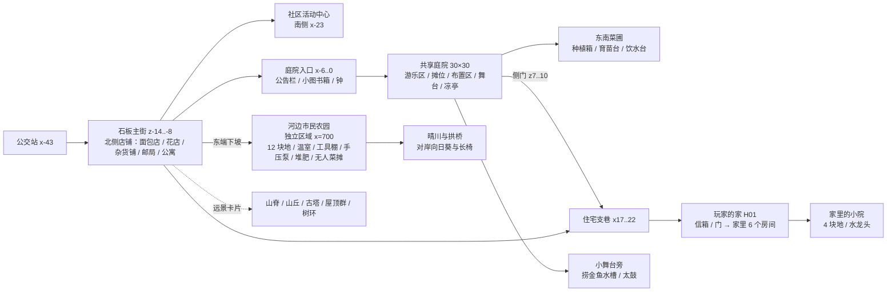

# 世界背景与地图 v0.6

## 电视与实体货架陈列（2026-10-09）

电视画面沿真实玻璃曲面与轮廓建立，保留原壳体、架子与支撑；移开被壳体截断的节目名称。中央货架改为独立食品包装和现有米袋、瓶筐、陶器、蔬菜筐，两架分层内容、数量和间隔不同；墙架包装朝室内，后排朝对应走道。面包店陈列更多面包形状，保留玻璃柜和柜台通行。测量与来源见[陈列修复](SHOP_DISPLAY_FIX_20261009.md)。

当前引擎、交付和空间范围以[CURRENT_STATUS](CURRENT_STATUS.md)为准。日期段落保留当轮证据；锁屏/权限等待曾是工具阻断，现已能持续按键并复测首餐入口，未完成的专用路线仍保留待验。

当前引擎、交付和空间范围以[CURRENT_STATUS](CURRENT_STATUS.md)为准。日期段落保留当轮证据；锁屏/权限等待曾是工具阻断，现已能持续按键并复测首餐入口，未完成的专用路线仍保留待验。

## 墙面、桌面与实体牌签（2026-10-08）

四间室内保持同一种手绘动漫画法，按商店、烘焙、工作和居家用途调整墙面、地板与收纳。工作间有旧会场简图、分类账本、材料箱、备用竹条和真实试样小桌；原试挂通道保留。面包店合作纸签在(-1.55,0,1.35)的实体架上，原互动停点(-1.1,.9,1.8)不变。牌签贴实际桌围板、箱体、碗柜或货架，木柱背面不遮字，路标箭头指向真实道路。详见[场景质感](SCENE_QUALITY_20261008.md)。

## 行走镜头与桌面测量（2026-10-08）

玩家和跟随镜头共享物理帧，并在渲染帧之间插值。室内固定俯角和室外镜头避障继续使用现有规则；传送时重置人物与镜头的旧位置。未开始的晚会不测桌面高度，实际桌面测量在桌子更换、移动、旋转或缩放后更新。卧室及商店街的原生复测见[卡顿修复](DESKTOP_STUTTER_20261008.md)。

## 首餐经过真实门路（2026-10-07）

卧室南墙继续保持实体边界，厨房目标按当前房间先指可走的门口。客厅一堆搬家纸箱移出近侧门的通行线，保留生活布置；从真实起床位置到碗柜的路线按0.8米全身胶囊连续检测。原生键鼠复测已走通卧室、客厅近门、走廊、厨房暖帘和便笺，详见[FIRST_MEAL_ROUTE_20261007.md](FIRST_MEAL_ROUTE_20261007.md)。

## 苗台上的可保留空处（2026-10-07）

P08现有麦茶托盘在玩家真正帮忙后可留在z15.45或15.75，完整脚印由实际桌面支撑；内部植物、动态物件和平移过程均检查。z16.05虽有支撑却与植物相交，不采用。晚会食物z14.60仍保持空出，W13小桌及其杯碗位置独立。见[早晨切片](RESIDENT_MORNING_20261007.md)。

## 湖岸与浅滩细节（2026-10-07）

桥边水道增加缓弯与宽窄，桥口锚点保留；水面、连续地形和岸边碰撞共用轮廓。浅水可见水底和溪石，湖心较深蓝，沿岸30处石头贴实际溪床。远岸向日葵改为两个小组共4株；路面有磨痕和局部变化，农园立牌加入叶纹与青海波边饰，桥木有板间色差与旧雨迹。原通行路径和钓点检查通过。实景与来源见[本轮记录](LAKESIDE_POLISH_20261007.md)。

## 商店与面包店的实体陈列（2026-10-07）

中央货架和墙架改为实体包装商品，蔬果篮和园艺工具独立展示；商店东南侧增加熟食台，两种食品落在真实木托盘上。面包店补入奶油面包、甜甜圈和两层蛋糕陈列，重建薄玻璃木框柜以看清食物。三张海报挂在凸出木框的室内侧，商店墙架新增动态屏幕电视。新货架、工具架经过门口净空和店主工作路线检查，食品逐件记录支撑层高。模型、坐标、来源与原生画面见[商店记录](SHOP_LIFE_20261006.md)。

## 日常位置与轨迹观测（2026-10-06）

邻居保留主要工作地点，加入晴天周末/工作日的短暂休息日程；现场台词按实际位置区分。搭话暂停普通日程，工作中仍可听个人小事或继续工作；首次认识记录实际呈现，旧存档不补造会面。巡游猫、鸟与昆虫用独立种子在常见区域活动，存读档保留随机状态。位置、出现顺序、切场与接触记录见 [运行检测](WORLD_RUNTIME_RESULTS_20261006.md)，其中静态休息动物出勤和未审阅的边界框候选仍列为后续工作。

## 已采用的地表组合（2026-10-06）

地面 A、水面 B、草地 B、沙地 A、木地板 A、石板 A 已作为普通游戏默认组合。B 水面减少亮带与泡沫，B 草地降低草高和风动强度，同时使用平涂草底；建筑、花草模型、碰撞与路线保留。默认选择在 game/data/material_selection.json，由 Main 调用 MaterialChoiceProfile 应用。实际六视角与录像在 evidence/material_selection_20261006/。

## 当前地图的材质选款预览（2026-10-06）

六类表面各增加四个评价选项，直接在现有地图中切换：农园入口地面、桥边河水、河岸草地、滑梯旁沙坑、住宅木地板，以及花店前街道石板。当前版本作为 A，另外三款比较平涂、手绘夏日和淡色方向。只切换材质和草叶着色器参数，现有建筑、草簇网格、通行碰撞与路线保留；面板能逐项切换并恢复原材质。操作与 72 秒场景录像见 `art/poc/material_scene_options_20261006/README.md`。用户选定的 A/B/B/A/A/A 现已接入普通游戏；其余选项仍可用于对比。

## 风、花草与天气联动（2026-10-06）

新增三只金鱼陶瓷风铃和 170 丛雏菊混合草、芦苇，均使用 imagegen 参考与 Hyper3D 模型；纸签单独摆动，草花固定根部随风弯曲，树冠偶尔落叶。原猫、蝴蝶、草叶和水流保留，并接上雨天联动。河声按实际水岸距离变化，手绘云层与太阳、雨圈跟随天气和时刻；进屋关闭室外粒子与声音。道路与钓点留出通行距离，新河岸草丛按真实地面射线贴地。近景、录像、来源与工具见 [本轮记录](ENVIRONMENT_LIFE_20261006.md)。

## 街区地图标签（2026-10-06）

密集商店区域的地名按锚点四周尝试位置，检查全部先前标签和画布边界；较远标签用连接线指回地点。地图仍朝北，右侧地点列表仍按真实世界坐标设置导航。布局26项专项通过，原生像素复验另记，详见[原生试玩记录](NATIVE_UI_REVIEW_20261006.md)。

## 喝茶后的日常小桌（2026-10-06）

现有W13小桌在真实麦茶完成后开放，位于(13.6,0,17.45)，不依赖接受小菜回请。新增桌边E入口供普通饭菜自用；普通一份用桌面空角，避开茶托与故事碗。室内/农园/隐藏时不可消费，旧档不补写过去的共餐。人物和模型文件未改，详见[小桌复用](SUMMER_TABLE_REUSE_20261006.md)。

## 回请改用干净小桌（2026-10-06）

真实浏览器图发现P08植物遮住一只碗，原数学支撑不能算净空。现使用已有Hyper3D W13，在(13.6,0,17.45)留共享小桌；后侧摆茶托盘，两碗初案在x±.2/z+.1。首次回请后保留，小桌与茶具归世界节点并参加实际摆放普查。原育苗台物件保留。浏览器图片与摆放/保存复验见SUMMER_INTEGRATED_20261006。

## 浅渍共享空面（2026-10-06）

以下为已弃用的P08两碗历史方案；当前共餐使用上节W13，不能照这组旧坐标摆回苗台。

P08育苗台前侧`(15.8, support_y+0.014, 15.8)`用于两小碗。已量56点与碗脚印四角，拒绝最高面与支持面不一致的位置，避开原茶托盘及晚会食物；初选的16.2/14.6高处未采用。切法/盐粒/留汁与两份余量分别显示。原生未完成，不能据此标模型摆放验收。见SUMMER_RECIPROCAL_20261006。

## 杯边食物空面（2026-10-06）

新篮取放继续使用当前真实公共桌。春的配茶份放在 P08 上的独立空面 `(15.8, support_y + 0.012, 14.60)`，杯托位于原有麦茶角，不覆盖它。领取与安放分别走真实路线，安放停点为 `(14.6, 0, 16.1)`；只在放置当天显示该份，历史记录保留。支撑与路线专项通过，新增原生画面因锁屏尚未验收，见 SUMMER_FOOD_PURPOSE_20261006。

## 试挂与便笺（2026-10-06）

工作间固定通道x=1.8、侧吊点x=.75；晾纸架(.9,0,-1)先于挂法出现。室外活动纸架位于(-3.9,0,-4.6)、(3.1,0,9.8)，活动日/明确重约出现，碰撞随活动可见状态启闭；不是采用低挂才临时制造障碍。近/远观察镜头使用实际观察点和实体，安全支路另测。

花火后的便笺实际支撑在家中I02书桌，内容来自选择，旧完成档不倒填。花火过场恢复原先站位和镜头，避免结束落在长椅里。

## 晚会桌面与同灯收回（2026-10-06）

晚会纸签在(8.5,1,10.4)，Q05完成且第16天以后显示。盘/纸包使用空间项目当前选定桌面，未做空间项目时沿用P09柜台；表面查询限于1.5米以下，避免把食物放上摊位顶棚。三个份量平放，领取后对应减少。

明确重约可在当前庭院使用同一盏灯，不重建原夏祭日期。收回后实际灯体放在工作间桌面，当前实例只有一处，已有安装记录保留。工作间陈列仍是灰盒，需要继续补生活内容。

## 夏祭空间预览（2026-10-06）

Q13独立区域x[-11.5,11.5]/z[12,24]，舞台、屋台与舞圈按实际尺寸预览，固定设施使用当前碰撞；退出编辑恢复旧布置区。纸签space_plan在(10,1,12)，Q11以前隐藏。三种用途停点由选定的实际桌椅生成，观看镜头使用实际居民头部位置。

## 吃饭镜头（2026-10-06）

吃饭近景对准真实饭桌、面包店柜台或面包推车上的小盘。食物使用有真实厚度的3D网格和真实盘/托盘支撑，吃过后保留同一承托面的空盘状态；角色不握食物、不做送到嘴边的动作。首餐既有的两份陈列在演出期间暂隐藏，避免重复显示；返回后由实际库存与首餐状态更新。

## 社区工作间灰盒（2026-10-06）

新增workroom，位置(110,0,400)、面积12×9米，从社区中心center_door进入，经workroom_exit回街。工作桌、账本储物架、活动标牌台和试挂架各有独立交互与实体碰撞；真实门洞、外侧地面与室内恢复已接入。中央桌已采用Hyper3D W13，原始GLB保留，尺寸1.8×0.78×0.9225米，倾斜0°；实景桌面支撑通过。其他陈列仍为灰盒。

代表灯笼有框、纸面、接头、挂绳、图样与暖灯。试挂架支撑高度2.9米，高挂或低挂改变实际悬挂。夏祭入口用可移动支架，入口指路观察点位于实际庭院门道；玩家带到现场才显示。同一作品从室内到现场再检查，不额外复制材料。详见[工作间实施](SUMMER_WORKROOM_20261006.md)。

## 回忆场景与共同水槽（2026-10-05）

2026-10-05这一轮没有新增地图或工作间；后续已经接入社区工作间，见上面的工作间段落。榉树的现有交互引出树下记忆；旧照片和澪的交谈引出纸网约定与停办片段，三幅原序章插画保留用于手账回看。

共同看金鱼和合影复用庭院goldfish_pool的真实位置。若从农园或室内约起，会实际退出该区域回到镇上，再把空和澪安排到池沿；放人使用physical_point，不能用会返回区域出口的任务指路点。拍照暂隐藏HUD、指针和人物标签，保存实际画面后恢复镜头与控制；无鱼袋道具就不在收藏中写持有鱼袋。头像、模型、建筑和画风均复用本轮前已验证素材。

## 首三天生活物件（2026-10-05）

家中碗柜便笺位于房间局部(-2.95,1.18,1.65)，互动life_pantry；饭桌互动life_meal_table(-2.3,.9,3)，使用已有J03真实桌面。育苗台P08上的麦茶托盘位于镇(15.8,桌面,15.15)，life_tea入口(15.1,.9,15.5)。面包推车纸牌(-21.25,车面+.13,-15.1)，店内柜台也有对应牌；入口分别life_bakery_card与life_bakery_card_in。纸牌有折脚，扶正与字号变化同步。

W12木托盘、W11陶瓷茶具均经WorldBuilder.spawn放置。support_surface记录具体支撑物，审计再核对该点的实际渲染三角面；摆放错了仍报悬浮。生活物件只在相应介绍日之后可发现，旧存档从首次读入该版本之日计算，不会出现不可见物件的E提示。茶与牌对白有独立镜头，吃喝短动作结束恢复原镜头。

## 2026-10-05 中央老树与免费植被

院子中央换为按序章 P3_tree.jpg 制作的独立老树 T05，树冠约 13 m 宽，粗干低处分叉；两侧补木椅和实际可行走的石板区域，树根新增摆放净空半径 2.4 m。树的交互点移到南侧，原剧情仍称榉树。道路、林缘和花坛另外适配 9 个 CC0 植被资产，并放置 12 处草花点缀；风分为树干与叶片权重。详见 [老树参考与实景](HERO_TREE_20261005.md)、[素材库与适配](ASSET_LIBRARY.md)。

公交拟合到 4.6 m 长，真实窗洞加九块独立玻璃；到站后停靠，司机可对话。坐猫按实际墙帽高度支撑。水面改用半周期交叉平流与解析小波坡度，河纹沿弯道流动。见 [场景反馈修订](SCENE_POLISH_20261005.md)。

## 2026-10-05 四季与场景扩展目标

用户希望夏祭之外继续有春、秋、冬，并增加可游玩的生活场景。本轮提出 8 片体验不同的区域、12 处可进入空间：在现有主街、住宅、农园和水岸基础上，扩山脚乡道与果园、山林溪谷、神社温泉巷、车站与邻村；开放更多店铺、街坊家和共同做饭的空间。数量与具体地点仍是提案，未改变实际地图。

季节内容、区域联系、室内用途与制作顺序见 [四季生活与场景提案](research/2026-10-05-four-seasons-and-scenes.md)。下面继续记录当前工程的布局与历史更新。

## 2026-10-04 商店街与南町住宅街

住宅支巷向南延长到 z=85.2，增加六栋房屋、院落花木、信箱、自行车、矮墙与路灯。商业区仍在主街，住宅区位于支巷以南；街道能实际步行到尽头，新增六栋房屋的室内未开放。南侧远景移到新边界外。公交增加停车开门、下车与驶离的开场；湖泊和河湾增加天空反射、浅水纹路与夕照高光，室外雾与补光降低。

麻雀增加独立翼片、啄食与下降落地，坐猫保持爪的接触而局部转头，睡猫改为胸腹呼吸；完整四足动画的调研见 [动物动画](ANIMAL_ANIMATION_20261004.md)。坐标、玩法与拍照功能见 [生活更新](LIVING_TOWN_20261004.md)。

## 湖畔、钓鱼与地图（2026-10-03）

农园向东连续延伸为晴川河湾与镜波湖，新增环湖步道、草坡、树荫和栈桥，室外区域地表统计约为原来的 2.40 倍（剔除水域与近岸保护带，未扣建筑占地）。小地图跟随玩家，M 展开。公寓与商店增加手绘旧化和住户差异；其余房屋未在本轮全面重做。范围与数据源见 [湖畔与钓鱼](LAKESIDE_AND_FISHING.md)。

## Hyper3D 建筑替换候选（2026-10-03）

主街、支巷与公民馆共 12 类建筑改用 Hyper3D 主体；H01 拼接独立主屋、缘侧与格子门，H02 外廊后方拼入六个单户门窗模块。身体比例按生成件等比保留，不再压回旧的宽深。各建筑原点不变，门前陈列与 8 块橱窗按新门面重新设置。面包店入口横坐标从 -25.6 调整到实测门中心 -23.12，自动演示站位同步调整。支巷的小祠堂从 (21.3, 29.9) 移到 (21.3, 31.2)，避开加宽住宅和巷尾围墙。旧位置信息作为历史记录保留。

当前版本属于画面检查候选，整栋大面积贴图密度尚未全数过线。数据和制作经验见 [Hyper3D 场景替换](HYPER3D_SCENE_REPLACEMENT_20261003.md)。

## 试吃纸签与集市陈列（2026-10-01）

面包店左前方的 G11 面包推车上增加纸签和木支架，纸签按菜单选择显示两行文字；最高支撑高度从现有推车网格测量，原家具、店主站位和店门保持原坐标。店内期间 Main 优先保留当前店主在 keeper 点，节日和日程更新不能把他拉走；出门后回到当天的正常日程。推车右侧新增 `bakery_orders` 交互点，位置是室内局部 (-2.48, 1.1, 3.067)。

庭院原面包篮加小纸牌和三明治小份。菠萝包为主时留七个面包与一个三明治小份；新三明治为主时留三个面包与三个小份。第一次试吃开摊后显示，文字和数量随存档中的菜单选择恢复。P09 台面实测高 0.525 米，试吃篮原点改为 (1.4, 0.585, 15.1)，篮底贴台面；纸牌低于棚沿，不再悬空或被棚挡住。构件直接使用已有的平涂材质与中文字体，没有新增外部生成模型或碰撞体。

## 设定

晴町是山脚下的虚构日本小社区。石板主街两侧是开了多年的小店，南边是被矮墙围起的共享庭院，东侧是安静的住宅支巷。年轻住户不多，庭院渐渐冷清。玩家搬来后，和邻居一起办一个小小的周末集市。

故事冲突只来自日常心愿：莲担心新面包没人喜欢，春舍不得荒掉的菜圃，澪想让新住户融入社区。没有灾难、战斗或拯救城镇的情节。

v0.4 加进来的小故事：主街东端下坡是“晴川”边的市民农园，管理员田中爷爷是春认识六十年的老朋友，五十年前给她写过一封没寄出的信，一直塞在工具棚的梁上；春其实知道。春的孙女小葵暑假从大阪来住，想给奶奶种一朵比自己还高的向日葵当生日礼物。澪二十年前骑在爸爸肩上逛过庭院集市，那张照片藏在公告栏背后。莲想用街坊种的菜做“街坊三明治”。这些都通过日常对话和 ♥4 / ♥5 小剧情慢慢讲出来。

## 人物

| 人物 | 身份 | 位置（准备阶段 → 集市） | 喜欢的装饰 |
| --- | --- | --- | --- |
| 我（空） | 刚搬到支巷的新住户，玩家角色 | — | — |
| 澪 | 社区活动联络人 | 主街公告栏前 → 摊位西侧 | 彩旗串 |
| 莲 | 年轻面包师 | 面包店门口 → 摊位前 | 纸灯笼 |
| 春 | 退休园丁 | 庭院东南角菜圃 → 摊位东侧 | 绣球花盆 |
| 田中爷爷（74） | 河边市民农园管理员，春的老朋友，话少、会教人 | 农园工具棚 / 菜地 / 河边长椅 → 集市时被春拉来 | 最喜欢萝卜 |
| 小葵（10） | 春的孙女，暑假来住，第 2 天出现 | 庭院 → 农园河边 → 沙坑 → 集市上帮奶奶看摊 | 最喜欢向日葵、草莓 |
| 和子阿姨（55，v0.6） | 晴町商店店主，嗓门大、热心肠，夜市最热闹时她还是店里帮忙的小姑娘 | 晴町商店柜台后（7:48–19:12）→ 周六集市在庭院西边逛到摊位旁 | — |
| 千代、阿健 | 花店、杂货铺店主（只有商店界面与头像名，没有 3D 模型） | 店内 | — |

## 地图（Godot 坐标，米；+X 东，+Z 南）

| 区域 | 范围 | 内容 |
| --- | --- | --- |
| 主街 | 车道 z −14..−8（6 米宽），人行道到 −15.5 与 −5.5，立面间距约 10 米 | 北侧 S01（v0.5 起是“晴町商店”，门口有货架、菜箱和木招牌）S02 面包店（门口有面包推车）S03 S08 S05 H02 等；路灯、电线杆、自动售货机、花箱；东头停着一辆轻卡（靠北侧路沿、顺着街停）；街尾（x 42.7）的墙开了口，立着和农园入口同一座灯笼门，门外的碎石小路下坡进树林，路边两盏纸灯；门前立着“河边农园 →”的路牌 |
| 庭院 | x −13..17，z −5.5..24，四周 0.7–1.5 米矮墙 | 秋千、滑梯、沙坑、凉亭、小舞台、摊位 P09、中央大树、回收站；小舞台旁的捞金鱼水槽 G02（−8.1, 16.9）和太鼓 G09（−7.7, 20.4） |
| 菜圃 | 庭院东南角 | 种植箱（可种番茄，三阶段）、育苗台、饮水台、菜畦 |
| 支巷 | x 17.2..22.2，z −5.5..32 | 玩家家 H01、另两栋住宅、花盆、尽头链桩 |
| 玩家的家 | 独立区域（ROOM_ORIGIN z=400），进出门淡入淡出；13 × 7.8 米，平房 | 见下表 |
| 河边市民农园 | 独立区域（FarmBuilder.ORIGIN x=700），从主街东端淡出进入；在农园时小镇整体隐藏 | 见下表 |

### 玩家的家（相对家的原点，米；+X 东，+Z 南）

| 房间 | 范围 x0..x1，z0..z1 | 地面 | 里面有什么 |
| --- | --- | --- | --- |
| 玄关 | 3.5..6.5，1.0..4.5（z ≥ 2.8 是低 12 cm 的洗石子地面） | 洗石子、木地板 | 出生点，大门（往南走出门），鞋柜，门口地垫 |
| 走廊 | 0.5..3.5，1.0..4.5 | 木地板 | 电话柜（电话），盆栽，通往客厅和厨房的门 |
| 厨房 | −6.5..0.5，1.0..4.5 | 木地板 | 灶台和水槽（窗外是画出来的街景），冰箱，电饭煲柜（捏饭团），碗柜，餐桌，暖帘 |
| 客厅 | −1.5..6.5，−3.3..1.0 | 榻榻米（1.8×0.9 米错缝铺，带布边） | 被炉，电视柜，五斗柜，书架，坐垫，电风扇，搬家纸箱（拆箱整理） |
| 卧室 | −6.5..−1.5，−3.3..1.0 | 木地板 | 床（存档），书桌（地图拼图），格子窗，落地灯，奶奶的壁橱（西墙），龟背竹；拼好的地图挂在北墙 |
| 缘侧 | −1.5..6.5，−4.6..−3.3 | 木板 | 客厅北面的玻璃拉门外；晒太阳的猫，金鱼缸（捞到金鱼后出现），脱鞋石；从脱鞋石处的缺口走下小院 |
| 小院（v0.4） | −1.5..6.5，−8.3..−4.6（地面低 45 cm，有坡道） | 草地 | 4 块菜地（Q06 后可翻土），水龙头可以装水，踏脚石、晾衣架、绿篱 |

### 河边市民农园（相对农园原点，米；+Z 朝南是河）

| 位置 | 坐标 | 内容 |
| --- | --- | --- |
| 入口 | x −28..−22，沿 z≈0 的碎石路 | 回晴町的路口，“晴町 市民农园”木牌，树荫下的长椅（有只三花猫在睡觉） |
| 菜地 | x −3.45..3.45 四列 × z −3 / −5.3 / −7.6 三排 | 12 块地：第一排 Q06 开放，后两排在种植 2 / 4 级时向田中爷爷扩租（200 / 600）；围着木栅栏，东边立着稻草人 |
| 工具棚 | (−10.6, −8.2) | 田中的种子铺；旁边手压泵 (−7.2, −3.8) 和堆肥箱 (−13.9, −4.9) |
| 温室 | (11.8, −6.4) | 半透明塑料棚，里面 2 块只种草莓的地，不受天气影响 |
| 无人菜摊 | (6.5, 2.9) | 按原价卖菜，Q07 用 |
| 别人家的地 | 温室以东 6 块、工具棚以西 4 块 | 装饰用，种着番茄、黄瓜、毛豆、向日葵，让农园看起来有人在用 |
| 晴川 | z 14..20，横贯全场 | 流动水面着色器，石砌河岸，两岸有芦苇和蒲草；v0.5 换成 Blender 里搭的 10 米拱桥，从北岸路口一直跨到对岸，桥面可走、栏杆挡人；北岸长椅 (9.6, 12.3) 可以坐着看河（时间 +1 小时），盂兰盆时在桥上放灯笼 |
| 对岸 | z 20..34 | 下桥后碎石小路通到河边步道：小祠堂和地藏、两座石灯笼、长椅、一排向日葵、大树；远景是河对岸的堤坝、稻田、电线杆和山（codex 画的背景卡片） |
| 入口（v0.5） | x −26 | 挂红灯笼的木门“晴町 市民农园”，门上方写着“← 回晴町”，远处也看得到；旁边是三向路牌（回晴町 / 菜地·温室 / 河边·木桥） |
| 其他布置（v0.5） | 各处 | 停在路边的轻卡、菜箱、手推车、雨水桶、农具架、柴堆、古井、石块；温室后面第二间温室（扩建后开放）；草地上铺满草丛和野花 |

家四周是矮木板围墙和小院：北面一排绿篱，绿篱后是向后倾斜、正对镜头的庭院画（石灯笼、踏脚石、柿子树），东西两侧和南面是木板墙，南墙留门口，踏脚石通到门外。

边界用墙体、链桩和远景卡片表达，不用透明墙冒充可走区域。走到边界点会有一句提示说明不能再往前。

## 状态变化

同一空间有“准备前 → 准备中 → 集市”三组状态（v0.4 起还叠加一天里的时刻与天气）：空摊位 → 摊位上摆面包篮；公告栏 → 贴出活动海报；空种植箱 → 湿土幼苗 → 结出番茄；庭院空地 → 玩家摆的桌椅与装饰；白天 → 傍晚暖光、路灯与纸灯笼亮起，三位邻居聚到摊位前。

## 美术规则与镜头

总的规则在 [ART_STYLE.md](ART_STYLE.md)：新海诚风格的动漫风，不走写实。下面是它在场景里的具体做法。

- 新海诚风的光：通透蓝天全景天空（4K 等距柱状图）、暖阳与偏蓝阴影、ACES 类色调映射、轻雾、SSAO 与辉光。
- 地面始终干燥：石板、砾石、草地用 codex 生成的无缝贴图，着色器去掉高光，只保留漫反射和大尺度明暗变化；只有种植箱的土在浇水后变深。
- 第三人称镜头：默认约 7.5 米、俯角 24°；弹簧臂防穿墙；家里改为固定斜俯视（俯角 50°、9.2 米），所在房间南边的墙降成 32 cm 高的矮墙。
- 家里的画风（不走写实）：
  - 地板、墙面贴图都是 codex 画的手绘贴图，按世界坐标铺，墙被切矮也不会拉伸；
  - 墙面有手绘斑驳、木腰板、踢脚线、门楣高度的长押和天花边线，都在着色器里画出来；
  - 光照是两段色阶：受光面平涂暖色，阴影用淡紫色补光，不会变灰；家具模型也换成同样的卡通漫反射、去掉高光；
  - 看不见的屋顶只投影子，阳光从北面的玻璃拉门和卧室格子窗照进来，地上有窗格和柱子的影子；
  - 另加画出来的光柱（叠加混合的薄片，按白天太阳方向扫出，柱子处留出暗缝，边缘和斜看时淡出）和光里飘的灰尘；
  - 傍晚：太阳压低变橙，光柱收起，吊灯和台灯亮起。
- 一天的光影（v0.4）：13 个关键帧按分钟插值，太阳从东边升起、正午最亮、17:20 左右是金色夕照、18:30 路灯亮、19:30 以后是月光；天空在白天、黄昏、夜晚三张 codex 画的全景图之间混合，并缓慢旋转，看起来云在飘。远景卡片、河面、家里窗外的画都会跟着变暗变暖。
- 天气：多云和下雨降低阳光、加浓雾、降饱和；下雨时镜头周围有雨丝，风也更大。
- 风：树、灌木、花和作物在顶点着色器里随风摆动，越高摆得越多，每棵的相位不同，雨天摆得更厉害。
- 草地（v0.5）：地面着色器把三张 codex 画的草地（草坪、开小花的野草地、深绿草丛）和裸土斑块按大尺度噪声混在一起；上面再用 MultiMesh 撒草丛和野花（8 种：嫩草、长草、三叶草、蒲公英、紫花、枯草、蕨、波斯菊），跟着风摆，55 米外淡出。小镇的草坪、墙根、支巷的院子和家里小院也都有。
- 节日布置（v0.5）：七夕在庭院门口立两枝挂满短册的竹子和一串灯笼；品评会在滑梯旁摆一张铺白布的长桌，放着对手的作物；夏祭在庭院南边搭盆舞台（Blender 程序生成），两个屋台，五串红白灯笼从盆舞台顶上拉到四周；花火在河对岸上空炸开；灯笼流时一盏盏纸灯笼顺流漂下；月见在门口摆供台，天黑后庭院南边的屋顶上方挂着一轮大满月（从夜空贴图里抠出来的月亮，贴在远处的面片上，因为贴图里的月亮位置太高，镜头拍不到）。
- 小动物：会跳着啄食、人一靠近就扑棱飞走的麻雀群；在庭院矮墙上、农园长椅上睡觉的三花猫（有呼吸起伏）；支巷墙头会转头看你的橘猫；白天绕花飞的蝴蝶，河上和菜地上的红蜻蜓。

## v0.6：晴町的过去、店里面、第三章的地点

小镇的历史、人物的过去和第三章的剧情写在 [LORE.md](LORE.md)。地图上多了这些东西：

| 地点 | 位置 | 内容 |
| --- | --- | --- |
| 晴町商店（室内） | 门口在主街西头 (−36, −14.9)；室内在 (50, 0, 400)，11 × 8 米（第四轮放大） | 木地板、灰泥墙，两排奶油色双面货架（Blender 生成，四层摆满商品）、墙上的木架、冷饮柜、冰柜、菜箱、柜台和收银机，和子阿姨站在柜台后；两盏吊灯；墙上挂着 codex 画的店面画 |
| 莲的面包店（室内） | 门口在 (−25.6, −14.9)；室内在 (80, 0, 400) | 白瓷砖后墙；西墙靠着两座斜面包架（Pixal3D，四层藤托盘上摆着菠萝包、可颂、红豆包、咖喱面包、吐司、法棍的模型）；蛋糕柜和柜台连成一排朝着门口，莲在柜台后；后墙是双层烤箱（Blender 生成）、揉面台和石磨；面包推车在进门左手边 |
| 奶奶的壁橱 | 家里卧室西墙 | 两扇纸拉门的壁橱，Q10 从这里开始 |
| 庭院的榉树 | 庭院中央 (4, 7) | 新增交互“看看庭院的榉树”，说“约定之树”的旁白；夏祭前一天起，树上挂着七个晴天娃娃 |
| 农园的柴堆 | 农园工具棚旁 | Q13 在这里搬木料 |
| 河对岸的小祠堂 | 农园对岸 (−6.6, 26.2) | 晴之祠，找到“晴之祠的绘马” |
| 节日布置 | 农园河边 | 盂兰盆那几天，河岸竹竿上挂着八盏白底蓝色桔梗花的盆提灯；花火大会那天，岸边拉起红白纸灯笼串 |

灯笼全部换成 Blender 程序生成的纸灯笼（见 [PIPELINE.md](PIPELINE.md) 第 12 节）：庭院、夏祭、七夕的灯笼串是红底“祭”和白底红圈“晴”交替的提灯，会随风轻轻摆动；农园大门挂两盏白底“晴”灯笼；可放置的“纸灯笼”装饰也换成了红色“祭”灯笼；灯笼流用的是木框四面纸灯，四面分别写着“祈”“想”、画着莲花和“晴”字纹。

## v0.6 反馈之后的摆放修正

| 地方 | 改了什么 |
| --- | --- |
| 去农园的路 | 以前主街尽头是一整面墙，农园那头却是灯笼门和小路。现在两头是同一座灯笼门（P_farm_gate），主街那头的小路是一段下挖的碎石路（两侧草坡，`WorldBuilder.lane()`），往东 20 米降 3.4 米进树林；农园那头同样的小路往西上坡 3.2 米进树林。门外有一道只挡玩家、不挡镜头的隐形墙 |
| 公告栏 | 以前在矮墙里侧、板面探出墙外，看起来嵌在墙里；现在立在墙外人行道上，背靠矮墙（z −6.05），交互点在正前方 |
| 小卡车 | 模型本身斜了 51 度，放进场景像歪停在路中间。转正后镇上顺着北侧路沿停（33.8, −12.85），农园那辆挪到主路南边、工具棚对面（−10, 2.85），和路平行 |
| 商店 | 柜台（重做）转正、朝向店内，和子阿姨站在柜台后面；冷饮柜和冰柜换成程序模型 |
| 农园河边 | 花火和灯笼流时，澪、莲、小葵、田中爷爷原来的站位分别站进了花丛、桥栏和长椅，都挪开了 |
| 农园的古井 | 井的屋顶架在模型里斜了 52 度（第一轮复查误当成圆的没转），转正后开口一面朝着主路 |
| 面包店 | 面包架离墙 0.45 米、面包飘在架子前面：按网格量出四层托盘的真实高度和深度，面包放在托盘上并跟着托盘倾斜，架子贴墙；推车从门右边的墙角挪到进门左手边；蛋糕柜挪到柜台旁边连成一排；石磨转正 |

## 第四轮反馈修正

| 地方 | 改了什么 |
| --- | --- |
| 去农园的草地 | 支巷和主街交界处草地纹理有一道硬边（`feather` 参数没关掉），去程和回程看到的草不一样。关掉硬边、在交界处补了一段过渡草地，两头看到的是同一片草 |
| 南排房屋背面 | 背后的“后院”草地原来统一收到 1.5 米深，社区中心（S06）进深达 10.9 米，比同排的 H03 深一倍多；一开始想把矮墙沿 S06 的位置往外挪出一个凹槽，把整栋房子的进深都圈进院子里——结果是玩家能一路走到房子背面很近的地方，抬头正对着没做完的屋顶背面（不是模型损坏，只是背面没细化，近看像破碎的蓝色屋瓦）。改回统一 1.5 米深的矮墙，不管房子多深，墙都紧贴在前面挡住；近处只会看到墙和露出墙头的一角屋顶，跟现实里矮墙外探出屋顶一样，不再顶着脸看背面 |
| 商店、面包店室内 | 8×6 米放大到 11×8 米，家具按同比例重新摆位。放大后发现从店里瞬移出门那一帧偶尔会踩空——引擎瞬移后重新贴地的判定和瞬移本身抢了一帧；给玩家加了“瞬移后跳过一帧贴地检查”，出门不再偶尔掉空 |

## 第五轮（v0.7.3）摆放修正

整个世界的道具都用 `PropAudit` 普查过一遍（见 [PIPELINE.md](PIPELINE.md) 第 14 节），下面是改动的地方：

| 地方 | 改了什么 |
| --- | --- |
| 商店门口 | 货架和菜箱放平以后变深，后半截插进店面墙（墙在 z −15.51）：货架 z −15.7 → −15.2，菜箱 −15.6 → −15.15，贴墙不穿 |
| 面包店门口 | 推车旁边那块写着“そば”的小黑板（A13）和面包店无关，挪到自动售货机和邮局之间 (9.5, −14.8) |
| 和子阿姨 | 进商店时由 `Main.enter_interior()` 放到柜台后的站位（`InteriorBuilder.SPECS.store.keeper`），出店后回到日程；日程里那条落在室内坐标里的旧站位改成店门口 (−35.2, −14.4) |
| 家里 | 卧室西墙的衣柜模型和壁橱摆在同一个位置，删掉衣柜模型；坐垫离书架挪开 0.15 米；收纳箱离盆栽挪开 0.3 米 |
| 支巷 | 信箱 H07 和第一盆绣球花顶着院墙端头，各往巷子里挪了一点 |
| 街尾小路 | 两盏纸灯原来按小路中线的高度摆，放在坡上就插进坡里 1.15 米；改按坡面高度，小路也补了碰撞体 |
| 盆舞 | 和子阿姨抬手不再拉起围裙，加入舞圈，舞圈从 6 人变成 7 人 |
| 店面橱窗 | 商店、面包店（两块）、花店、杂货书店、邮局的玻璃上加了“室内映射”面片：看进去是一间有后墙、侧墙、地板和陈列架的屋子，随镜头错位，傍晚亮灯（`shaders/shop_window.gdshader`） |

## 建筑局部样件（2026-10-01）

S01 侧墙挂上木板腰墙、压条、角柱和石脚；商店与面包店内增加 2.8 米木构墙框，中央 P_gondola 换成同占地、同商品层高的木架。共享庭院的前六段围墙改成灰墙与石脚，顶端有立体蓝灰瓦帽；其余街区边界保留水泥砌块。碰撞、出口、店主站位与 Layout 坐标沿用原值。Hyper3D 町屋 J01 仅在 `architecture_review.tscn` 对比场景中出现。来源、尺寸与截图见 [ARCHITECTURE_REVIEW.md](ARCHITECTURE_REVIEW.md)。

## 门楼、旧材质与树背景（2026-10-01）

原门楼、路牌、木桥、盆舞台与新木构件换做旧贴图；坐标、尺寸和桥面 deck 保留。门楼匾额文字移到木板表面外。农园近距离低分辨率树卡片改为 1774×887 的真实透明图，远层在可走边界 20 米外；近层由 3D 树提供深度，远景草地覆盖到树根下面。前后实景与证明见 [TEXTURE_REVIEW.md](TEXTURE_REVIEW.md)。

## Hyper3D 道具与字牌（2026-10-02）

农园与主街两端的 `P_farm_gate`、夏祭 `P_yagura`、面包店 `P_deck_oven` 使用 Hyper3D 原稿制作游戏版。场景位置和原占地沿用；门楼两端使用共用的实测字牌高度 2.35 米和独立立柱碰撞，开口仍可通行。主街邮局前的 A13 两面改为“晴町案内”，不再写荞麦面；面包店 S02 图集重绘，几何与橱窗测量不变。原图、尺寸与验收见 [HYPER3D_QUALITY_REVIEW.md](HYPER3D_QUALITY_REVIEW.md)。

## 建筑和环境模型更新（2026-10-02）

H01、H02、H03、S06 使用新的 Hyper3D 动漫参考模型，仍放在 Layout 的原位置，保留旧占地。H03 的缘侧降低、纸门按人尺度校正并补木格；社区会馆背面、门口台阶和坡道均拍了近景。农具棚改成完整板材屋面，麻雀改成圆润的动漫造型，电线杆去除碎线与反光。两只环境猫和面包使用重绘图集；小葵、田中爷爷重新整理网格和绑定。场景 414 个模型实例的摆放普查通过，无重叠、穿墙、悬空或陷地。对比图与测量见 [MODEL_AUDIT_20261002.md](MODEL_AUDIT_20261002.md)。

## 建筑近景反馈修正（2026-10-02）

用户指出公寓和会馆近看弯曲、缺少日式细节，并要求增强商店菜筐。对比服务原稿与游戏版确认变形在原稿中已有；随后以米制 Blender 构件和 imagegen 材质修正街区 12 种建筑，保留占地和用途。梁柱、窗框、纸门、格子、雨户、椽头、瓦块及瓦当为真实几何；门牌、招牌和价格签用可读文字。菜筐有独立图集，玻璃反射为手绘底色。六块商店橱窗从导出网格重新测量。

每栋正反左右全貌、四向近景及檐口共九张，合计 108 张；另有实际场景近景、白天与夜间菜筐、商店窗户与街区视角。发现并修正瓦面行缝不足、侧墙错位、匾额遮挡，以及地台边缘与推车、小祠堂相交。最后模型专项 31 项、全量 398 项均通过，无 SCRIPT ERROR。旧数据三项新增回归均失败，射线结构基准要求小于 6 毫米，菜筐实际密度高于 300 px/m。

工具、可编辑源文件、素材来源与多面验收见 [ARCHITECTURE_CLOSEUP_20261002.md](ARCHITECTURE_CLOSEUP_20261002.md)，证据在 `evidence/architecture_closeup_20261002/`。Hyper3D 原稿保留；此次修正后的建筑结构来源为 Blender，没有新增 Hyper3D 积分生成。

## 2026-10-03 建筑材质补全

12 类 Hyper3D 建筑沿用当前位置、尺寸和碰撞，补充旧木、瓦釉、灰泥、布纹以及各店铺和住宅的立面画法。门窗独立结构、奶奶家低翼、公寓六个住户和店面室内映射保持接通。四面及门前近景记录在 `evidence/building_materials_20261003/`；具体细节和制作经验见 [建筑修订记录](BUILDING_MATERIALS_20261003.md)。本轮沿用已扩展的湖区、四个钓点和小地图。

## 远方小记（2026-10-03）

镇内两处在公民馆东侧和公寓旁；农园三处在湖北岸长椅、北侧林缘和农具棚西侧。配置坐标统一由 Homage.world_position 转换，农园仍位于世界 x=700。 具体发现方式与位置见 [彩蛋记录](HOMAGE_20261003.md)。

## 真实橱窗与树形（2026-10-03）

S01、S02、S03、S05、S08 的八扇底层窗户改成真实开口与 2.2 米深的陈列室。花盆、面包、托盘、米袋、瓶筐和茶具用小模型拼成前、中、后三层；邮局复用书架和包裹。商品和台面留在玻璃内侧，傍晚用实际灯照亮。店外绿色黄瓜圆片换成两筐整条黄瓜，沿原菜台坡度摆放。

镇边与小路的近树卡片换成三种新树形，镇内共 38 棵，农园外缘与上坡补入十五棵。远山和远处树林保留绘画背景。店铺坐标、可进入室内、原有湖区、钓点、小地图和五处远方小记沿用。来源和近景验收见 [拼接记录](WINDOW_DISPLAYS_20261003.md)。

## 地图导航（2026-10-03）

地图标记使用实际交互点；农园本地坐标统一换算为世界 x=700 一带。选择跨区域地点时先指向东侧出镇或农园西侧上坡出口，再继续指向目的地。金圈留在圆形小地图边缘内侧，显示直线距离。标记不改变世界交互、任务与存档规则；制作和验证见 [界面与地图](UI_MAP_REFRESH_20261003.md)。

## 统一界面素材（2026-10-03）

地图、HUD、对话、背包、日历、商店、钓鱼和小游戏共用晴町和纸素材库。圆形地图仍以羽化遮罩与透明细圆环收边；按钮、物品格、提示卡和面板按统一的角色和状态取图。工具图标补入设置、关闭、返回、确认、礼物、钓竿、爱心与筛选。库的独立工程和使用说明见 [UI_KIT.md](UI_KIT.md)。

## 截图中的摆放修复（2026-10-04）

住宅支巷木桶移到院内(23.4,12.3)，侧门石头移到石灯笼附近(16.0,11.0)。公寓外楼梯旁的树移到建筑后方绿带(32.1,-28.2)。所有模型树按可见地形重新贴地，猫和长椅按实际墙帽/座面/地形对齐。

公民馆路灯旁的献礼盒及交互按用户要求移除，不换新模型。其余四处远方小记保留；旧盒子存档记录不会再计数或产生交互。模型原稿和其他店面摆放保留。具体原因、检查范围与坐标见 [摆放修复记录](PLACEMENT_REVIEW_20261003.md)。

## 2026-10-04 公交入口与场景细节

公交换成生成车身并拆出可动车门、车轮。候车亭增加清晰的站名、路线和时刻表；西侧围墙打开，连接外部道路、护栏、沙质路肩与草地。镇边墙和庭院墙增加弧形瓦帽、瓦缝与瓦当。石板、沙地和草地换用新绘的动漫纹理，南町补种草叶；钟面与场景标牌使用独立清晰字形。见 [制作与验收](TOWN_DETAIL_20261004.md)。

## 住宅街巡游猫（2026-10-04）

住宅街白天加入橘猫与三花猫的站姿四足巡游。橘猫活动范围 x=19.2–20.4、z=54.4–55.6；三花猫 x=19.2–20.4、z=68.4–69.6。每轮经过四个路点后停一下，转向与腿部动画一起播放。原墙上坐猫、睡猫保留原行为；新猫暂为环境角色，没有新增奖励或喂食规则。来源和真实主场景近景见 [猫的模型与动作](CAT_MOTION_20261004.md)。

### 空取餐柜台（2026-10-07）

P09 改用 Hyper3D CLI 的空柜台与蓝白棚顶，保留原镇坐标。台面内部的蔬菜筐不再遮挡试吃；盘沿、纸托四角、模型内外净空和近景视线共同验收。面包篮按新柜台真实高度及八个边缘支撑点摆放。模型来源与被拒候选见 [试吃记录](TASTING_USE_PLAN_20261007.md)。

## 前次广场与老树空间（2026-10-10）

六项设施、局部草坪与花簇、实体围栏底部沿用2026-10-09已验修改。新老树约13.016米宽、9.151米高，生成弯枝和树结配独立透明树冠；低根收紧，站立高度碰撞偏向+Z，根部另有低碰撞体。小葵回集市时绕过右侧长椅，莲的月见观望点移至左侧净空处。树下代表灯笼吊点前移至(4,0,10.8)，对应近观和通道一起调整，保留低侧挂、高通道挂与再次使用的选择。剧情`zelkova`身份不变。当前桌面交付和实景见[广场升级](PLAZA_DELIVERY_20261010.md)。

## 广场树冠与墙外草地更新（2026-10-10）

老树目前约12.441米宽、9.078米高，分成九组扁冠和透光间隙；八层短绒苔藓贴在低根，远距淡出，保留原来的剧情与交互身份。墙外杉树统一换分簇针叶。四区外地面加入色差、6589簇草和矮灌木；东侧缓坡有实际地面碰撞，植被贴合坡面，农园和西侧道路留空。吊点、居民绕行和既有设施沿用前次交付。图像和验收见[树冠与苔藓](CANOPY_DEPTH_20261010.md)。

## 三处公共场景的材质与陈设（2026-10-10）

社区中心、面包房和商店的室内分别使用安静的松木板面与色泽，新增3/2/1个实际侧窗。窗格阴影来自真实开口与日照，夜晚窗外景按世界夜色渐暗。社区档案、纸卷和布料沿墙放置，工作台中央保留给代表灯笼；面包房补备料、包布和托盘，商店补包装台与壁边小物。23件小物按实际渲染表面验证支撑。门前公告盒、雨帽、图稿、植物及布篷支架已落地，原门口、无障碍坡道、橱窗和居民路线保持可用。实景、近远与日夜对照见[三处公共场景](THREE_PLACES_IMAGEGEN_20261010.md)。
