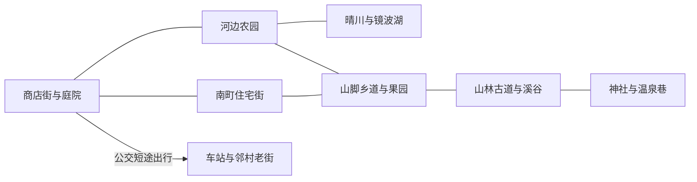

# 晴町四季生活与场景扩展提案

2026-10-05。用户已明确整体方向：夏祭主线只是游戏的一部分，后续还有春、秋、冬，希望有更多场景和更丰富的生活。

执行顺序补充：用户随后明确先完善现有入场与夏季，每天一段生活剧情，并通过十一维好玩审核后再继续。当前先执行 [夏季逐日计划](../SUMMER_DAILY_STORY_PLAN.md) 与 [好玩审核](../FUN_REVIEW.md)；下面的秋冬春扩建仍是长期提案，首批秋季扩建建议暂后移。

本提案把晴町扩为能过一整年、并继续生活的世界。建议按现有夏天回乡的开场，走过夏、秋、冬、来年春，再到来年夏。夏祭负责夏天的一段人物故事；之后的季节有各自的食物、去处、邻里关系和日常安排。

下面的 8 片区域、12 处室内和事件数量是建议的内容规模，尚未成为实际地图、制作预算或交付承诺。当前工程仍以夏季到初秋为主。本轮只更新设计文档。

## 当前场景为什么显得单薄

从本轮源文件核对：室外区域状态主要是 `town` 与 `farm`。小镇已有商店街、庭院和南町住宅街；农园区域已有晴川、河湾、镜波湖和四处钓点。新湖区和住宅街已经增加了可走的地方，不能当作不存在。

真正可进入的生活空间仍主要是奶奶家、晴町商店和莲的面包店。花店、杂货铺、邮局等有外观、交互或橱窗，但不能据此算作完整可游玩的室内；住宅街新增的六栋房屋也还未开放室内。许多不同活动仍回到庭院和同一批柜台完成。

这意味着下一轮要同时扩三件事：能去的地方、在里面做的事、同一个地方随时间发生的变化。单纯拉长道路、增加树木或多放几栋不能进去的房子，很难满足这次的目标。

## 建议的八片可游玩区域

这里的区域按玩家体验划分，可以共享底层场景或连续地形，不要求做成八张彼此隔开的加载地图。

| 区域 | 当前基础与扩展 | 日常用途 | 适合发生的故事 |
| --- | --- | --- | --- |
| 商店街与榉树庭院 | 已有；补花店、杂货铺、邮局、公民馆及食堂的室内 | 采购、吃午饭、寄信、借工具、逛集市、碰到熟人 | 店里的新菜单、帮忙收摊、寄走第一份家乡食物 |
| 南町住宅街 | 已有室外；开放春家和一两户邻居的生活 | 串门、还饭盒、借伞、一起吃饭、照料门前小院 | 邻居临时不在家、有人搬来、春要空来尝一道菜 |
| 河边农园与工具屋 | 已有菜地、棚和温室；扩成可进入的工具屋 | 种植、育苗、整理农具、留种、冬天在棚里做小手工 | 田中教手艺、分一袋种子、别人家的地换了作物 |
| 晴川与镜波湖 | 已有水岸；增加野餐点、芦苇小路和湖边歇脚处 | 钓鱼、散步、吃便当、观察鸟、晚上看水面 | 雨后相遇、有人每天坐同一张长椅、冬天的湖边来信 |
| 山脚乡道与果园 | 新增；包含果园、少量梯田和旧校舍外院 | 帮忙收果、认识季节食材、走田埂、到阅览室借书 | 第一筐秋果、稻田忙起来、校舍里找到奶奶借过的书 |
| 山林古道与溪谷 | 新增；与山脚、农园形成步行联系 | 采集游戏内明确标记的食材、散步、在溪边休息 | 迷路后认路、跟邻居学一种处理食材的办法、返程分东西 |
| 山上神社与温泉巷 | 新增；已有小祠继续保留在原处，不算替换 | 登坡、参拜、泡汤、在休息厅喝热茶或牛奶 | 年末约着出门、初雪之后的相聚、春天山路再次热闹 |
| 车站与邻村老街 | 新增；从已有公交线路延伸短途可游玩目的地 | 接送小葵、买晴町没有的东西、短途出门、看展或赶小集 | 人来人往、熟人从城里回来、空给家里寄东西 |

山林、湖边和神社也允许只是安静走一走，不把每个角落都变成接任务的柜台。食堂、邮局、工具屋则应该有明确的日常用途。

### 区域之间的联系

这是提案中的关系示意，不是最终地形和坐标。

每天最常走的家、菜地、商店和食堂仍应接近。登山和去邻村可以占用一个上午或下午，给出门准备和返程留出空间。新区域先通过一次自然的介绍让玩家知道路，不要求全部通关夏祭才能探索。

## 建议的十二处可进入空间

完整目标先按 12 处安排：现有 3 处，加 9 处新室内。是否继续扩到更多住户，等第一轮的内容密度验证后再定。

| 室内 | 状态 | 除了看布景还能做什么 |
| --- | --- | --- |
| 奶奶的家 | 已有 | 吃饭、做饭、看信、安排明天、招待来串门的人，物件随生活改变 |
| 晴町商店 | 已有 | 采购、借伞、打烊前聊天、看到季节商品和熟客 |
| 莲的面包店 | 已有 | 烘焙、试吃、定菜单、早晨和关店前的小场景 |
| 千代花坊 | 新开放 | 包花、做押花、挑送人的花、听春与千代各说一段往事 |
| 阿健的杂货铺 | 新开放 | 修饭盒、找旧工具、借缝补材料、看新收到的二手物件 |
| 晴町邮局 | 新开放 | 给家里寄食物、收小葵的信、寄年贺卡、买不同信纸 |
| 公民馆共用厨房 | 新开放 | 街坊一起做饭、分秋天的收获、冬天煮一锅热食 |
| 春的家 | 新开放 | 吃一顿家常饭、归还饭盒、看小葵留下的东西、一起整理花盆 |
| 田中的工具屋 | 新开放 | 修农具、分种子、在雨天或冬天做与种植有关的小事 |
| 街角食堂 | 新增建筑与室内 | 点一份午饭、看每日菜单、与其他食客闲聊、帮忙试菜 |
| 旧校舍阅览室 | 新增 | 借书、整理旧照片、看孩子的小展览、雨天待一会儿 |
| 温泉休息厅 | 新增 | 泡汤后的短场景、买饮品、与平时忙着工作的邻居坐下来聊天 |

奶奶家的六个房间仍按一处室内计算，不把拆分房间算成六个新增地点。新的室内也必须真正可进入、能行走并有可重复的生活内容，不能只弹出商店面板。

## 四季怎样分别写

| 季节 | 空的生活变化 | 食物与日常提案 | 重点空间 | 人物故事 |
| --- | --- | --- | --- | --- |
| 夏 | 刚回乡，慢慢认识路和街坊 | 第一次收菜、夏天的简单饭、夜里散步、小葵放暑假 | 主街、住宅、菜园、水岸 | 夏祭是其中一段；空开始有日常去处 |
| 秋 | 知道今天要去谁家，开始安排收获之后的生活 | 分果子、栗子饭、做保存食、换秋季菜单、扫落叶 | 果园、乡道、山林、食堂、邮局 | 小葵回去后保持联系；莲把早市提议真正办起来 |
| 冬 | 活动更多移到屋里，关系从碰面变成串门 | 热汤、缝补、整理旧物、年末准备、泡汤、短途接人 | 春家、工具屋、公民馆厨房、温泉、邻村 | 邻居相互照料；空愿意邀请别人到自己家，也能独自过好一天 |
| 春 | 开始为下一季做打算，去熟悉地方看新变化 | 育苗、换花、便当、种子交换、小葵短假来住、外出走山路 | 农园、花店、旧校舍、乡道、车站 | 新人来、熟人离开；空自己决定接下来怎样生活 |

来年夏天可以再次相聚，看过去一年留下了什么。再次夏祭不自动作为游戏结束，也不要求空承诺永远住在晴町。

这四季不需要分别再写一次“大型活动筹备成功”。秋天可以写一段收获和分食，冬天写一段串门与照料，春天写一段来去与重新种下东西。日常、人物事件和节日共同组成一年。

## 建议的全年故事量

完整第一年先以每季 12–15 段有动作和前后回应的小事件为写作目标，全年约 48–60 段。这个数字是提案规模，尚未完成台词、镜头或制作量估算。

另安排 6–8 条跨季的人物与生活故事，分散进入上述事件，不额外重复计数。天气问候、物品说明和普通闲聊另行补充，不能把这些短句都算作新剧情场景。

一段剧情场景至少有具体地点、参与的人、正在做的事，以及场景之后能看见或听见的变化。不要求每段都有选项、奖励或新系统。玩家路过看见邻居一起干活，也可以是一段完整生活场景。

### 各季先写哪些事件

下面每季列 12 个候选。用于展示内容宽度，具体数量、条件与顺序在实施前还要细化。

| 夏 | 秋 | 冬 | 春 |
| --- | --- | --- | --- |
| 第一晚的饭 | 第一筐果子 | 老房子的窗缝 | 田中的育苗盘 |
| 田中让空先尝一根菜 | 跟街坊做栗子饭 | 春家的第一锅热汤 | 第一次交换种子 |
| 春回送浅渍菜 | 春寄给小葵的包裹 | 和子提前关店的一晚 | 花店包一束告别的花 |
| 和子的借伞 | 雨天在阅览室遇到人 | 阿健修被炉线与旧家具 | 旧校舍的孩子画展 |
| 莲关店后的吐司 | 莲准备秋天的早市 | 工具屋里磨好一把农具 | 小葵短假来住 |
| 和千代一起包花 | 两个人扫同一条巷子 | 给小葵回信 | 河边第一顿便当 |
| 湖边吃便当 | 邮局收到小葵的回信 | 公民馆分一锅热食 | 乡道上的花重新开了 |
| 小葵画皱灯笼 | 邻村买回不同的调料 | 温泉休息厅里的闲聊 | 莲第一次换春季菜单 |
| 在工具屋借一件东西 | 山林采集后学着处理 | 年末一起做年节食物 | 南町有人搬来 |
| 夜里的水岸相遇 | 分出自己留着的一份收获 | 神社前等一个熟人 | 空带别人认识晴町 |
| 夏祭第二天收凳子 | 天凉后换家里的织物 | 在春家或自己家跨年 | 翻出去年留下的种子 |
| 送小葵到车站 | 田中把一袋种子装好 | 接来寒假探亲的人 | 给家里寄一份新收获 |

其中需要新增料理、信件、手工或 NPC 的候选，不能只靠已有对白就算完成。现有 Q16、夏祭和向日葵剧情会纳入全年结构；表中写作目标不是宣布再增加 48 条独立主线任务。

## 人物的故事怎样跨过季节

| 故事 | 夏 | 秋 | 冬 | 春 |
| --- | --- | --- | --- | --- |
| 空与奶奶的房子 | 找到旧碗柜，做自己的第一顿饭 | 第一次在屋檐下放自己做的保存食 | 修一点窗缝，邀请人来吃热饭 | 将留下的花种种在小院，开始自己决定摆什么 |
| 空与家里的人 | 电话里说已经安顿好 | 第一次寄食物，问对方喜欢哪一种 | 得到家里寄来的东西，也有人来短住 | 决定下一次回去看他们的时间；回乡与原来的生活保持联系 |
| 莲的面包店 | 三明治试吃，学习街坊的口味 | 兑现现有秋季早市提议 | 天冷时调整开店和备货，不把压力全交给玩家 | 用新食材做一款菜单，继续保留熟客喜欢的旧口味 |
| 澪的生活 | 熟悉邻居，重办夏祭 | 学会把集市和借还物件交给别人 | 有一个真正休息的日子，玩家能遇见工作之外的她 | 帮新住户认路，也安排自己的短途出门 |
| 春与小葵 | 一起种向日葵、过暑假 | 小葵离开，家里保留她的小物件，收到回信 | 春做一道家常菜，小葵寒假可能来几天 | 小葵回来看上次种的东西，也发现它已经变了 |
| 田中与农园 | 教空种第一批菜 | 收种、分种，谈一谈其他租地的人 | 工具屋成为聊天和整理的地方 | 育苗、认识新来租地的人，空也能教一点学过的事 |
| 街坊的饭盒与工具 | 借与送，认识彼此 | 回送、归还，知道别人怎么用 | 缝补或修一件旧物 | 收到新的邀请，也能说这次自己来做 |
| 晴町与外面 | 第一次知道公交去哪儿 | 到邻村见到不同店铺与熟人 | 接人、寄信、外地朋友来住 | 有人搬来，有人暂时离开，小镇继续变化 |

季节事件检查真实经历：没送过的东西不能被说成“你上次送的”，小葵不在镇里时不能照常站在庭院。完整人物收束也不再只靠满心触发。亲密可以让人更愿意聊天，但不能代替共同做过的事。

新角色先少量加入，例如食堂经营者、果园照看者和一位通勤住户。每个人要有自己的工作、住处和与现有居民的关系；不靠大量只有一句问候的新 NPC 填地图。

## 同一个地方也要变得不同

以春的家为例，夏天是风扇、麦茶和小葵的鞋；秋天是正在装箱的包裹和屋檐下的食物；冬天是热锅、被炉与靠近门口的围巾；春天是育苗盘和等人来取的花。小葵走后，空掉的鞋位或沙坑也能表现时间变化。

这不是四次简单换颜色。场景应同时改变可见物件、声音、居民活动、对白和可做的事。原来的地方也能让玩家有理由再来。

住宅街、山路、稻田、湖边、店铺和屋内需要不同的空间节奏。保留晴町的动漫画风，室内暖光、秋日低斜阳光、冬季淡蓝阴影、春季新绿都按 [ART_STYLE](../ART_STYLE.md) 制作。

冬天可以采用薄雪与偶尔降雪，具体程度待美术样片确定。不能假装现在已有雪天、整年作物或跨年日历。

## 一天可以怎样过

**秋天的一个普通日子：**早上在家吃一点东西，去农园收菜；顺着乡道到果园帮忙拿一小筐果子；中午回食堂吃饭，碰到和子；下午到邮局寄给家里，路过阅览室还一本书；傍晚在面包店听莲说周六菜单，晚上回家做饭。

**冬天的一个普通日子：**出门发现邻居还没把店门全拉起来；去工具屋拿修好的工具，在公民馆厨房尝一碗热汤；下午可以走山路去温泉，也可以留在家里缝东西；夜里收到小葵的信，决定改天回。

这些是可选安排，不要求一天做完。一天只钓鱼、只做一顿饭，或待在家里，也应成立。

## 制作顺序建议

### 先做秋季的完整一段

第一轮新增山脚乡道与果园、山林古道，并开放街角食堂、春家、公民馆厨房。连起来做“收一点东西、学一种做法、和别人吃一顿、把余下的寄出去”的生活片段，同时落实莲现有秋季早市提议。

这轮需要真实可走的新地点、三处可进入的生活空间，以及约 8–12 段有后续的场景。先用一次完整试玩判断场景是否丰富、走路是否过长、室内是否值得重复去。

### 再做冬季与更多室内

扩神社与温泉巷，开放工具屋、杂货铺和邮局；做全年日历、跨年、季节环境、室内日程，以及年末与串门剧情。冬天需要让活动自然转到屋里，不能只给现有菜园铺雪。

### 再接春季与外部世界

扩车站与邻村、旧校舍阅览室和花店；接育苗、种子交换、短途出行、小葵来去与新住户。把前几季记住的事带到春天，再回到来年夏天。

上述是制作优先级，不是玩家被强制解锁区域的顺序。长线目标仍是完整四季和足够多的生活场景；第一轮秋季片段用于验证方向。

## 实施时需要补的基础

当前 `date_of()` 从 7 月开始累加，未处理正常跨年；节日按开局后的固定天数匹配。玩家区域和地图指路也主要围绕 `town/farm` 写。四季与新区域需要明确扩展这些基础，不能仅在美术和对白层面宣布完成。

具体实施时要处理：

- 全年日期、星期、季节与跨年；首年专属人物事件和以后重复节日分开记录。
- 作物、采集物、料理和商店内容的季节变化。跨季提前告知，保留现有低压力规则，不突然摧毁玩家收获。
- 新区域的出入口、地图、导航、读档位置和居民日程；旧存档保留位置与经历，不重置为新开局。
- 小葵的返程、寒假或春假来访；通过信件保持联系，真实缺席时场景也有变化。
- 室内外的昼夜与天气、冬季环境、坐下、吃饭、拿物、包裹和归还动作。文字样稿不能代替动作实现。
- 新选择、回送、物件变化与人物记忆进入现有数据库保存流程；不采用独立临时文件冒充持久化。

## 怎样判断扩展是否够丰富

每个新区域实际试玩，至少能说明为什么今天想去、去了能看见谁或做什么、以后再去有什么不同。风景路线允许无任务停留，但不能把一整片空地算作完整内容。

室内必须检查真实行走、镜头遮挡、家具尺度、角色站位和键鼠操作。新增空间不能只是同一张房间换招牌。

跨季检查人物去留、节日参加事实、天气、作物、选择和存读档。慢玩或错过某一天仍能继续生活，不必为了看到冬天先刷完全部夏祭任务。

正式接入后按仓库流程做素材 import、相关测试、游戏截图与配音核对；大改再单独跑全量测试。当前文档提案没有运行测试结果。

## 当前实现依据

- [WORLD](../WORLD.md)：主街、住宅街、农园、湖区与室内的现有结构。
- [LORE](../LORE.md)：夏季人物过去、当前主线、三明治和既有承诺。
- [GAMEPLAY](../GAMEPLAY.md)：目前可做的事和低压力规则。
- `game/scripts/world/interior_builder.gd`：当前商店、面包店的室内定义。
- `game/scripts/ui/map_places.gd`：当前区域与地标。
- `game/scripts/autoload/game_state.gd`：日期、节日、玩家区域与保存。
- [小森林台词审阅](2026-10-04-little-forest-life-and-dialogue.md)：可继续使用的生活小场景与已发现的对白问题；其夏季范围建议以本提案更新为准。
