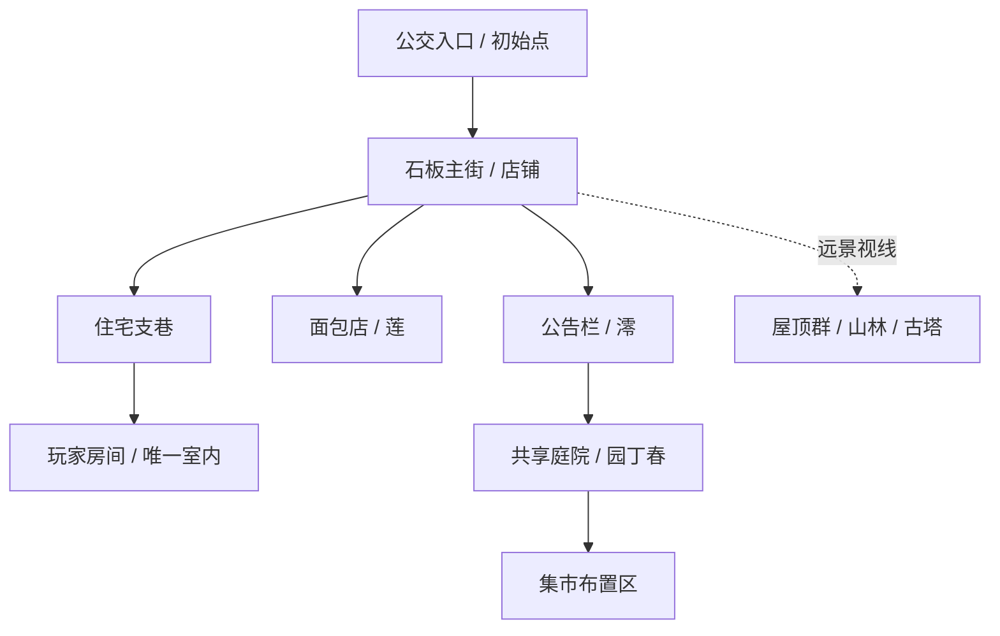

# 世界背景与场景设计

## 工作设定

晴町是一座山脚下的虚构日本小社区。沿石板主街是经营多年的小店，旁边有住宅支巷，街道尽头能看到林坡和古塔。年轻住户不多，公共庭院渐渐冷清；玩家搬来后，与邻居一起重新组织一个不大的周末集市。

基调是明亮、有人情味、有生活细节。故事冲突来自日常心愿：有人担心新产品没人喜欢，有人舍不得旧花坛，有人想把闲置空间重新开放。不安排灾难、战斗或拯救整个城镇的宏大任务。

## 三位核心 NPC

| 人物 | 身份与愿望 | 首版行为与回应 |
| --- | --- | --- |
| 澪 | 社区活动联络人，想让新住户更容易融入 | 公告栏介绍社区，结尾按布置选择评价活动 |
| 莲 | 年轻面包师，希望试做的面包被邻居尝到 | 店前交付篮子，集市时出现并聊起顾客反应 |
| 春 | 退休园丁，希望共享庭院继续有人照顾 | 指导种植，回访指出植物变化，结尾坐在庭院 |

人物名字、年龄段和故事是设计草案。先给每位角色一个可识别轮廓、两套表情和简短对话，避免在可玩验证前写过量长篇剧情。

## 空间关系

主街负责定向和展示，支巷提供安静探索，庭院承载主要状态变化。古塔是远景定位物，首版不可抵达；用道路弯折、围墙与自然地形表达边界。不要用看似可走的假门或透明墙误导玩家。

同一空间要有“准备前—进行中—集市后”三组状态：空摊位变成有面包的摊位，公告栏出现活动海报，种植箱出现新苗，人物从各自位置聚到庭院。优先制作这些能反馈玩法的变化。

## 美术规则

沿用已确认的新海诚动画风格方向：通透蓝天、明亮云缘、暖阳与蓝紫阴影、清晰线条与经过简化的色块。建筑以奶油白墙、木色、蓝灰瓦为主，店铺色彩用于识别功能。

街道路面完全干燥，粗糙石材只保留漫反射与树影，不出现雨后镜面、积水或大面积湿色。不要把地面反光作为“电影感”的来源。种植的浇水特效只作用于花盆和土壤，不改变天气。

前景用少量清楚的小物，中景依靠建筑轮廓与店门区分，远景降低对比。每个交互物附近保留干净空间，避免植物遮住门、任务目标和走道。建筑照片式噪点与重度旧化需减少。

## 镜头和环境

初始镜头距角色约 6 米、俯角约 35 度是灰盒候选值，真实测试后再定。目标是看清角色脚边物件，又保留天空与街巷纵深。支持有限旋转与缩放；狭窄区域用防穿墙镜头和遮挡淡出。

首版固定晴天午后，结尾过渡到温暖傍晚；不开发实时天气。行走时有脚步、轻风、鸟声和远处生活声；集市增添低音量交谈与餐具声。音乐与环境音可独立调节，音频来源单独记录。

## 后续背景素材

先做从玩家视角看到的庭院关键帧、可步行布局图、唯一室内草图、三位居民设定，再做可复用天空/云/远景卡片。现有元素大图继续作为美术参考；模型输入需要单体清晰视图，不能把九宫格直接当成一个建筑送去生成。

